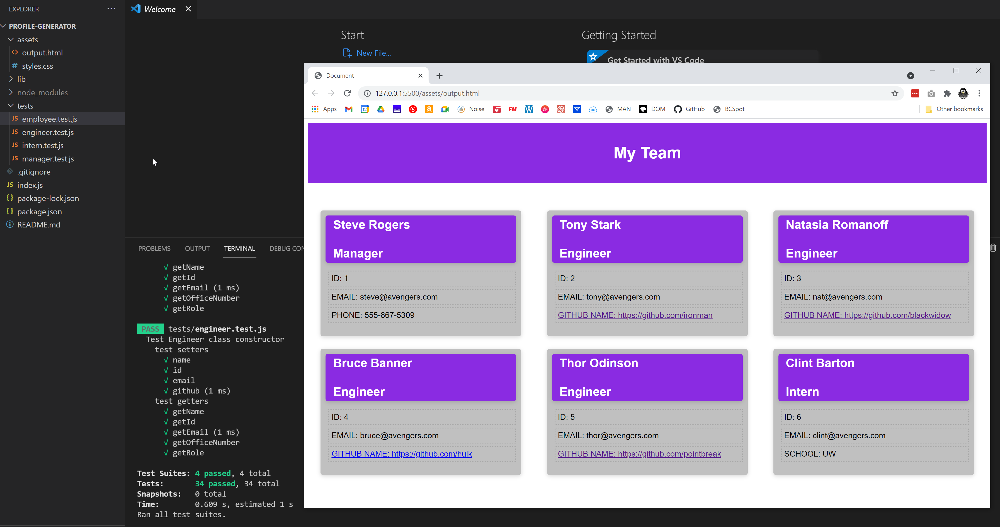

# TITLE: TEAM PROFILE GENERATOR

## Project Function:  
Command-line application to dynamically generate a webpage with members of a dev team.  

## Project Title: # profile-generator
Purpose: This project was created to explore node, classes/inheritance, dynamic HTML generation and to improve skills working with async functions. 

**Creation date:** July 2021  
**Collaborators:** Sheri Elgin

## Screen Cap


## Project Links
GitHub Source Code: https://github.com/grudgecat/profile-generator  \
Demo Video link:  \

***
## Dependencies 
node.js https://nodejs.org/en/  
npm package inquirer: https://www.npmjs.com/package/inquirer#questions
```
